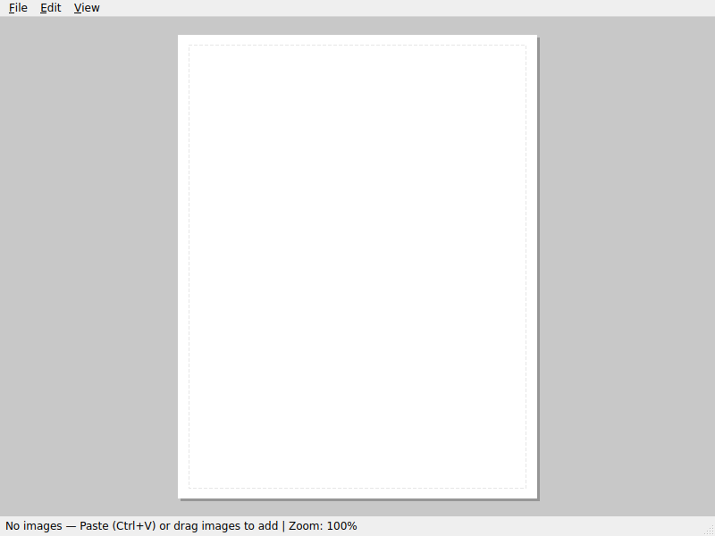

# Sticker Sheet Maker

A PySide6 desktop app for tiling pasted images onto a US Letter page for printing as sticker sheets.

## Concept

The user browses image sources (DuckDuckGo Images, etc.) in a browser, copies images to the clipboard, and pastes them into this app. The app automatically tiles all pasted images onto a printable US Letter page, optimizing layout with optional rotation. Empty gaps ("streets") between images provide straight cutting paths. The user prints the result onto sticker paper and cuts them out.

## Tech Stack

- **GUI**: PySide6 (Qt6 for Python, LGPL, native macOS look)
- **Layout**: Custom row-based tiler — log-scale sizing, row-height quantization, row packing (rectpack evaluated and dropped; row-based approach gives straight cut lines)
- **Image Handling**: Pillow (for image normalization before packing) + Qt's QImage/QPixmap (for display and print)
- **Project Files**: Python `pickle` — serialize the full project (image data + layout) into a single `.sticker` file
- **Print**: QPrintDialog / QPrinter (native macOS print dialog)

## Architecture

Single-file to start (`sticker_app.py`), split only when complexity demands it.

### Core Classes

- **StickerProject** — data model: list of images (as raw bytes + metadata), current layout result, page settings (letter size, margins, cut-line width). Pickle-serializable.
- **PageWidget(QWidget)** — the WYSIWYG page view. Paints the tiled layout at screen resolution. Handles paste events. This is the central (and only) widget in the main window.
- **MainWindow(QMainWindow)** — menu bar (File: New/Open/Save/Save As/Print, Edit: Paste/Delete Selected/Clear All), hosts PageWidget.
- **Tiler** — orchestrates the full layout pipeline: sizing, row assignment, and final placement. See "Layout Algorithm" below.

### Key Dimensions

- US Letter: 8.5 x 11 inches
- Print DPI: 300 (for high-quality output)
- Page pixels at 300 DPI: 2550 x 3300
- Margins: 0.25 inch (75px at 300 DPI) on all sides — keeps images away from unprintable edges
- Cut-line gap: ~4px at 300 DPI between images (empty space — "streets" for cutting, not visibly drawn)

### Layout Algorithm

The core insight: **image pixel resolution should NOT determine print size.** A 150x150 image and a 1500x1500 image should print at roughly the same physical size. The audience is a 5-year-old who wants consistent sticker sizes, and the operator wants straight cut lines.

#### Step 1: Assign "ideal" sizes via log scaling

Raw pixel dimensions are compressed with a logarithmic function to produce unitless target sizes that reflect the image's aspect ratio but dampen resolution differences:

```
ideal_size = log2(pixels + 1)
```

So a 150px-wide image gets ideal width ~7.2, and a 1500px-wide image gets ~10.5 — a 10x resolution difference becomes a ~1.5x size difference. Aspect ratios are preserved (the log is applied to both dimensions independently).

#### Step 2: Quantize heights into row bins

To enable straight horizontal cut lines along the long (11") dimension:
- Collect all ideal heights, cluster them into a small number of discrete row heights (e.g., 3-5 bins)
- Each image snaps to the nearest bin height; its width scales proportionally to maintain aspect ratio
- This means a row of images all share the same height — one straight horizontal cut per row

Bin selection can be simple: sort ideal heights, split into N roughly equal groups, use each group's median as the bin height.

#### Step 3: Pack rows onto the page

With quantized heights, the problem simplifies to a 1D strip-packing per row:
- For each row height bin, line up images left-to-right with cut-line gaps between them
- When a row is full (hits page width), start a new row of the same or different bin height
- Stack rows top-to-bottom with cut-line gaps between rows
- If the page overflows vertically, uniformly scale ALL bin heights down and repack

This approach may or may not use `rectpack` — it might be simpler to implement directly since rows + quantized heights reduce it to a much easier problem than general 2D bin packing. We'll evaluate during implementation: if the row-based approach works well, skip rectpack entirely; if we want to try mixed-height packing for better space utilization, rectpack with pre-quantized sizes is still an option.

#### Cut line goals

Cut lines are not visibly drawn — they're just empty gaps ("streets") between images where you cut. The layout creates straight cutting paths:

- **Horizontal streets span the full page width** (between rows) — fewest cuts, longest straight lines
- **Vertical streets are per-row** — within a row, images are separated by vertical gaps
- Result: a grid-like structure where each row has uniform height, easy to cut with a paper cutter

## Roadmap

### Phase 1: Skeleton App
- [x] Create `requirements.txt` (PySide6, Pillow)
- [x] Main window with menu bar (File, Edit menus — stubs)
- [x] PageWidget that draws a white US Letter rectangle centered in the window, scaled to fit
- [x] Status bar showing image count and zoom level

### Phase 2: Paste & Display
- [x] Handle Cmd+V / clipboard paste: extract image from clipboard (QClipboard.image())
- [x] Also handle drag-and-drop of image files onto the window
- [ ] Handle drag-and-drop of image URLs (some browsers supply a URL instead of image data) — detect URL mime type and download the image
- [x] Store pasted images in StickerProject as PNG byte blobs (normalize all formats to PNG via Pillow)
- [x] Display pasted images in a simple grid on the page (temporary, before real packing)

### Phase 3: Layout / Tiling
- [x] Implement log-scale sizing: convert pixel dimensions to ideal print sizes via `log2(px + 1)`, preserving aspect ratio
- [x] Implement row-height quantization: cluster ideal heights into N bins, snap each image to nearest bin
- [x] Implement row packing: fill rows left-to-right, stack rows top-to-bottom
- [x] Implement scale-to-fit: if rows overflow the page, uniformly shrink all bin heights and repack (binary search)
- [x] On every paste/delete, re-run layout and update PageWidget
- [x] Layout includes cut-line gaps (empty streets) between rows and between images within rows
- [x] Evaluate whether `rectpack` adds value over the row-based approach; use it or drop the dependency

### Phase 4: Print
- [x] File > Print: open QPrintDialog, render the page at 300 DPI via QPainter onto QPrinter (system print dialog provides Print-to-PDF for free)
- [x] Ensure WYSIWYG: same layout logic for screen and print, just different DPI
- [ ] Test with actual sticker paper

### Phase 5: Save / Load
- [x] StickerProject pickle serialization (images as PNG bytes, layout metadata)
- [x] File > Save / Save As: write `.sticker` file (pickled StickerProject)
- [x] File > Open: load `.sticker` file, re-tile, display
- [x] File > New: clear project
- [x] Track dirty state, prompt "unsaved changes" on close/new/open

### Phase 6: Selection & Polish
- [x] Click an image on the page to select it (highlight border)
- [x] Delete key removes selected image, re-tiles
- [x] Cmd+C copies selected image back to clipboard (nice-to-have)
- [x] Right-click context menu on images (delete, copy)
- [x] Undo/redo stack (QUndoStack) for paste and delete operations

### Phase 7a: macOS Packaging
- [ ] Create `setup.py` for py2app bundling (generates `Sticker Sheet.app`)
- [ ] Add `Info.plist` overrides: UTI declaration for `.sticker` file type, app icon, document icon
- [ ] Create app icon (`StickerSheet.icns`) — can be a simple placeholder generated from a PNG
- [ ] Create document icon (`StickerDoc.icns`) for `.sticker` files
- [ ] Handle `QFileOpenEvent` so macOS "Open With" / double-click launches the app with the file
- [ ] Write `build_mac.sh` script that automates the full build (do NOT run — macOS-only)
- [ ] Test that double-clicking a `.sticker` file in Finder opens the app and loads the project

### Phase 7b: Test Suite (Headless / Virtual Display)
- [ ] Add `requirements-dev.txt` with test dependencies (pytest, pytest-qt, Pillow)
- [ ] Configure `QT_QPA_PLATFORM=offscreen` for headless Qt testing (no X11/Wayland needed)
- [ ] Write test fixtures: generate simple shape images via Pillow (colored rectangles, circles, stars)
- [ ] Test paste workflow: create app headless → paste generated images → verify layout runs
- [ ] Test save/load round-trip: paste images → save `.sticker` → load → verify images match
- [ ] Test tiler directly: feed known image sizes → verify row packing, quantization, scale-to-fit
- [ ] Test print render: render to QPrinter with PDF output → verify file is created
- [ ] Add `conftest.py` with shared fixtures (app instance, sample images, temp directories)

### Phase 7c: Howto Guide
- [ ] Write `generate_howto.py` script that uses headless mode + Pillow shapes to produce a step-by-step visual guide
- [ ] Steps captured as screenshots: empty app → paste first image → paste several → show tiled layout → save → print-to-PDF
- [ ] Output a markdown file (`HOWTO.md`) with inline images showing each step
- [ ] Reuse the test fixtures (Pillow-generated shapes) so the guide is reproducible and self-contained

### Phase 7d: Stretch Goals (Deferred)
- [ ] ~~Multiple pages~~ — **on hold**: multi-page printing requires manual sheet feeding, not practical yet
- [ ] Manual image reordering / pinning (lock an image's position)
- [ ] Adjustable margins and cut-line style in preferences
- [ ] Global hotkey to capture image under mouse cursor from browser — ideas:
  - **AppleScript + screencapture**: Register a global hotkey (e.g. via PyObjC or a small Swift helper), use AppleScript to get the frontmost browser's current URL or run JavaScript to find the image element under the cursor, then download it. Fragile but zero browser extension needed.
  - **Accessibility API approach**: Use macOS Accessibility APIs (via PyObjC) to inspect the browser's DOM/AX tree for the image element under the cursor and extract its URL.
  - **PySide6 embedded QWebEngineView**: Ship a built-in mini-browser inside the app. User browses in-app; on click or hotkey, the app intercepts the image directly from the web engine. Full control, no AppleScript, but adds QtWebEngine as a heavy dependency.
  - **System-wide drag target**: Keep the app as a floating always-on-top thumbnail/dock. User drags images from any browser onto it. Already partially works via drag-and-drop; this just makes the drop target more accessible.

## Phase 7 Implementation Details

### 7a: macOS Packaging — Actionable Plan

**Goal**: Produce a `Sticker Sheet.app` bundle that users can drag to `/Applications`. Double-clicking a `.sticker` file opens the app and loads the project.

**Tool choice: py2app** (not PyInstaller). py2app is the native Python→macOS .app bundler, produces proper bundles with `Info.plist`, and handles Qt frameworks well. PyInstaller works too but py2app gives more direct control over the plist and bundle structure.

#### Files to create

1. **`setup.py`** — py2app build script
   ```python
   from setuptools import setup

   APP = ['sticker_app.py']
   DATA_FILES = []
   OPTIONS = {
       'argv_emulation': False,  # must be False for Qt apps
       'iconfile': 'icons/StickerSheet.icns',
       'plist': {
           'CFBundleName': 'Sticker Sheet',
           'CFBundleDisplayName': 'Sticker Sheet',
           'CFBundleIdentifier': 'com.stickersheet.app',
           'CFBundleVersion': '1.0.0',
           'CFBundleShortVersionString': '1.0',
           'LSMinimumSystemVersion': '11.0',
           'NSHighResolutionCapable': True,
           'CFBundleDocumentTypes': [{
               'CFBundleTypeName': 'Sticker Sheet Project',
               'CFBundleTypeExtensions': ['sticker'],
               'CFBundleTypeIconFile': 'StickerDoc',
               'CFBundleTypeRole': 'Editor',
               'LSHandlerRank': 'Owner',
               'LSItemContentTypes': ['com.stickersheet.sticker'],
           }],
           'UTExportedTypeDeclarations': [{
               'UTTypeIdentifier': 'com.stickersheet.sticker',
               'UTTypeDescription': 'Sticker Sheet Project',
               'UTTypeConformsTo': ['public.data'],
               'UTTypeTagSpecification': {
                   'public.filename-extension': ['sticker'],
               },
           }],
       },
       'packages': ['PySide6', 'PIL'],
   }

   setup(
       app=APP,
       data_files=DATA_FILES,
       options={'py2app': OPTIONS},
       setup_requires=['py2app'],
   )
   ```

2. **`icons/StickerSheet.icns`** + **`icons/StickerDoc.icns`** — macOS icon files
   - Can be created from a 1024x1024 PNG using `iconutil` on macOS:
     ```bash
     mkdir StickerSheet.iconset
     # add icon_16x16.png through icon_512x512@2x.png
     iconutil -c icns StickerSheet.iconset
     ```
   - For now, create placeholder PNGs via Pillow (a colored square with "SS" text) and document the `iconutil` conversion step in the build script

3. **`build_mac.sh`** — build automation script
   ```bash
   #!/bin/bash
   set -e
   # Clean previous builds
   rm -rf build dist
   # Create venv and install deps
   python3 -m venv .venv-build
   source .venv-build/bin/activate
   pip install -r requirements.txt py2app
   # Generate icons if .icns files don't exist
   if [ ! -f icons/StickerSheet.icns ]; then
       echo "WARNING: .icns files missing. Generate them with iconutil on macOS."
       echo "See icons/README.md for instructions."
   fi
   # Build the app
   python setup.py py2app
   # Result is in dist/Sticker Sheet.app
   echo "Built: dist/Sticker Sheet.app"
   ```

#### Code changes to `sticker_app.py`

- **Handle `QFileOpenEvent`**: macOS sends a `QFileOpenEvent` when a user double-clicks a `.sticker` file. The app must override `QApplication.event()` to catch this:
  ```python
  class StickerApp(QApplication):
      file_open_requested = Signal(str)

      def event(self, event):
          if event.type() == QEvent.FileOpen:
              self.file_open_requested.emit(event.file())
              return True
          return super().event(event)
  ```
  Then connect `file_open_requested` to `MainWindow.open_file(path)`.

- **Command-line file argument**: Also check `sys.argv[1]` at startup for a file path (some launch mechanisms pass the file as an argument rather than via `QFileOpenEvent`).

#### UTI / File type registration explained

- `CFBundleDocumentTypes` tells macOS "this app can open `.sticker` files"
- `UTExportedTypeDeclarations` defines the UTI `com.stickersheet.sticker` as a new file type
- `LSHandlerRank: Owner` means this app claims primary ownership of `.sticker` files
- After first launch, macOS Launch Services registers the association — `.sticker` files get the document icon and double-click opens the app
- `lsregister -dump | grep sticker` can verify registration (debug only)

---

### 7b: Test Suite — Actionable Plan

**Goal**: A pytest suite that runs headless (no display server) and tests the core workflows.

**Key technique**: `QT_QPA_PLATFORM=offscreen` — Qt's offscreen platform plugin renders to an in-memory surface. No X11, no Wayland, no Xvfb needed. Works on macOS, Linux, and CI. This is simpler and more portable than `pytest-xvfb`.

#### Files to create

1. **`requirements-dev.txt`**
   ```
   -r requirements.txt
   pytest>=7.0
   pytest-qt>=4.2
   ```

2. **`conftest.py`** — shared fixtures
   ```python
   import os
   os.environ['QT_QPA_PLATFORM'] = 'offscreen'  # must be set before QApplication

   import pytest
   from PIL import Image
   import io

   @pytest.fixture(scope='session')
   def qapp():
       """Create a single QApplication for all tests."""
       from sticker_app import StickerApp  # or QApplication
       app = StickerApp([])
       yield app

   @pytest.fixture
   def sample_images():
       """Generate simple Pillow shape images as PNG bytes."""
       images = []
       colors = ['red', 'blue', 'green', 'orange', 'purple']
       sizes = [(200, 200), (300, 150), (150, 300), (400, 400), (100, 250)]
       for color, size in zip(colors, sizes):
           img = Image.new('RGB', size, color)
           buf = io.BytesIO()
           img.save(buf, format='PNG')
           images.append(buf.getvalue())
       return images

   @pytest.fixture
   def circle_image():
       """A single circle-on-white image for simple tests."""
       img = Image.new('RGB', (200, 200), 'white')
       from PIL import ImageDraw
       draw = ImageDraw.Draw(img)
       draw.ellipse([20, 20, 180, 180], fill='red', outline='black')
       buf = io.BytesIO()
       img.save(buf, format='PNG')
       return buf.getvalue()
   ```

3. **`tests/test_tiler.py`** — unit tests for the layout engine
   - Test log-scale sizing: known pixel dims → expected ideal sizes
   - Test height quantization: given a set of ideal heights, verify bin assignment
   - Test row packing: given quantized images, verify rows don't exceed page width
   - Test scale-to-fit: stuff enough images to overflow, verify all rows shrink uniformly

4. **`tests/test_project.py`** — save/load round-trip
   - Create `StickerProject`, add images, pickle-save to temp file, load back, compare

5. **`tests/test_app.py`** — integration tests via pytest-qt
   - `qtbot.addWidget(main_window)` for lifecycle management
   - Simulate paste: directly call the paste handler with a `QImage` loaded from a Pillow PNG
   - Verify `PageWidget` repaints and image count updates
   - Simulate File > Save, verify `.sticker` file written
   - Simulate File > Open with saved file, verify images loaded

6. **`tests/test_print.py`** — print/render test
   - Use `QPrinter` with `QPrinter.PdfFormat` output to a temp file
   - Render the page via the same paint logic
   - Verify the PDF file exists and is non-empty (deeper PDF inspection optional)

#### Dev commands addition

```bash
# Run tests (headless, no display needed)
QT_QPA_PLATFORM=offscreen pytest -v

# Run tests with coverage
QT_QPA_PLATFORM=offscreen pytest --cov=sticker_app -v
```

---

### 7c: Howto Guide — Actionable Plan

**Goal**: A self-contained script that generates a step-by-step visual guide by driving the app headlessly and capturing screenshots at each step.

**Approach**: Use the same `QT_QPA_PLATFORM=offscreen` technique. The script creates a `MainWindow`, pastes Pillow-generated shape images one by one, and grabs the widget as a `QImage` after each step. Each screenshot is saved to `howto/` and a `HOWTO.md` is assembled referencing them.

#### `generate_howto.py` outline

```python
"""Generate HOWTO.md with screenshots by driving the app headlessly."""
import os
os.environ['QT_QPA_PLATFORM'] = 'offscreen'

from PIL import Image, ImageDraw
from PySide6.QtWidgets import QApplication
from PySide6.QtCore import QSize
# ... import MainWindow, StickerProject, etc.

def generate_shape_images():
    """Create a variety of colorful shapes using Pillow."""
    shapes = []
    # Red circle
    img = Image.new('RGBA', (200, 200), (255, 255, 255, 0))
    draw = ImageDraw.Draw(img)
    draw.ellipse([10, 10, 190, 190], fill='red')
    shapes.append(('red_circle', img))
    # Blue star, green rectangle, etc.
    # ...
    return shapes

def capture_widget(widget, path):
    """Grab a widget's rendered content as a PNG."""
    pixmap = widget.grab(widget.rect())
    pixmap.save(path, 'PNG')

def main():
    app = QApplication([])
    win = MainWindow()
    win.resize(QSize(800, 600))
    win.show()
    os.makedirs('howto', exist_ok=True)

    # Step 1: Empty app
    capture_widget(win, 'howto/01_empty.png')

    # Step 2: Paste first image
    shapes = generate_shape_images()
    # ... paste shapes[0] into project ...
    capture_widget(win, 'howto/02_first_paste.png')

    # Step 3-5: Paste more images, showing tiling
    # ... paste remaining shapes ...
    capture_widget(win, 'howto/03_multiple.png')

    # Step 6: Save
    # ... trigger save ...
    capture_widget(win, 'howto/04_saved.png')

    # Write HOWTO.md
    with open('HOWTO.md', 'w') as f:
        f.write('# Sticker Sheet — How To Use\n\n')
        f.write('## 1. Launch the app\n\n')
        f.write('\n\n')
        # ... more steps ...

if __name__ == '__main__':
    main()
```

The shapes from Pillow serve double duty: they're used in the test suite fixtures AND in the howto guide, keeping everything self-contained with no external image dependencies.

---

## Dev Commands

```bash
# Setup
python3 -m venv .venv
source .venv/bin/activate
pip install -r requirements.txt

# Run
python sticker_app.py

# Run with debug logging
python sticker_app.py --debug

# Run tests (headless, no display server needed)
pip install -r requirements-dev.txt
QT_QPA_PLATFORM=offscreen pytest -v

# Run tests with coverage
QT_QPA_PLATFORM=offscreen pytest --cov=sticker_app -v

# Generate howto guide (headless)
QT_QPA_PLATFORM=offscreen python generate_howto.py

# Build macOS app (macOS only — do not run on other platforms)
./build_mac.sh
```

## File Structure (target)

```
StickerSheet/
  CLAUDE.md              # this file
  requirements.txt       # runtime dependencies
  requirements-dev.txt   # test/dev dependencies
  sticker_app.py         # main application
  setup.py               # py2app build configuration
  build_mac.sh           # macOS .app build script
  generate_howto.py      # headless howto guide generator
  conftest.py            # pytest shared fixtures
  tests/
    test_tiler.py        # layout engine unit tests
    test_project.py      # save/load round-trip tests
    test_app.py          # integration tests via pytest-qt
    test_print.py        # print/render tests
  icons/
    StickerSheet.icns    # app icon (macOS)
    StickerDoc.icns      # document icon for .sticker files
    README.md            # instructions for regenerating .icns from PNGs
  howto/                 # generated screenshots (gitignored)
  HOWTO.md               # generated howto guide
  .venv/                 # virtual environment (gitignored)
```

## Design Decisions

- **Single file**: Keep it in one file as long as it stays under ~800 lines. Split into modules only when navigating becomes painful.
- **Pickle for save files**: Simplest possible persistence. `.sticker` files are just pickled `StickerProject` objects. Not meant to be cross-version stable — this is a personal tool, not a product.
- **Log-scale sizing**: A 10x resolution difference becomes ~1.5x size difference. Stickers end up roughly consistent in size, which is what a kid wants. The exact log base can be tuned.
- **Row-based layout over general bin packing**: Quantizing heights into row bins gives us straight horizontal cut lines for free. This sacrifices some packing density vs. arbitrary 2D packing, but the tradeoff is worth it — easier cutting matters more than squeezing in one extra sticker.
- **rectpack as optional**: We keep it in requirements as a fallback, but the row-based approach may be all we need. Will evaluate in Phase 3.
- **Scale-to-fit strategy**: Rather than rejecting images that don't fit, uniformly scale ALL bin heights down until the layout fits the page. Paste and it just works.
- **300 DPI internal**: All layout math happens in 300 DPI pixel space. The screen view scales down for display. Print renders at native resolution. One coordinate system, no conversion bugs.
- **Cut lines are invisible streets**: Gaps between images are empty space where you cut — no visible lines are drawn. Horizontal gaps span full page width between rows; vertical gaps separate images within a row. The layout is designed around cuttability, not just space efficiency.
