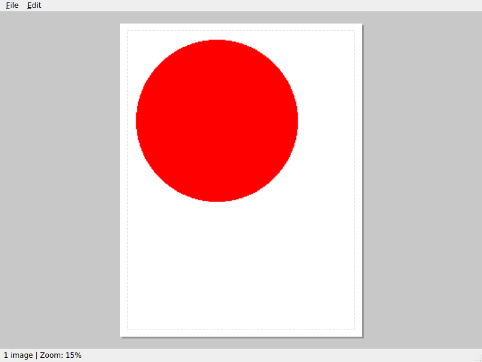
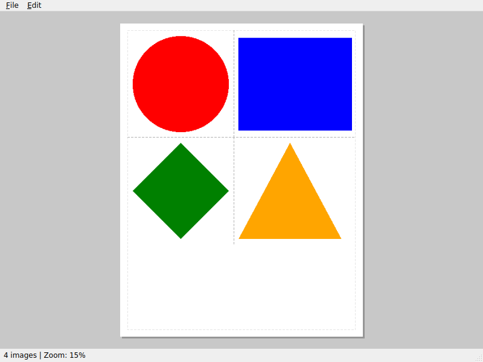
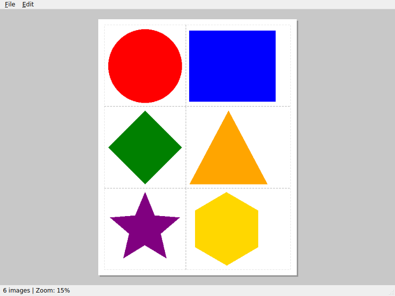
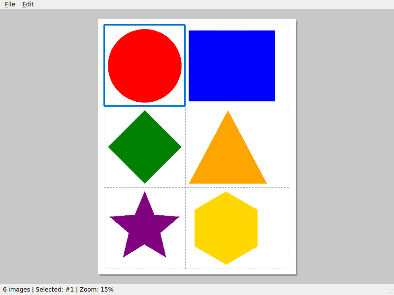

# Sticker Sheet Maker - How To Use

## 1. Launch the App

When you open the app, you see an empty US Letter page ready for stickers.

## 2. Paste Your First Image

Copy an image from your browser or any source, then press **Ctrl+V** (or **Cmd+V** on macOS) to paste it. The image appears on the page.

## 3. Paste More Images

Keep pasting images. The app automatically tiles them into rows with uniform height for easy cutting. You can also drag and drop image files onto the window.

## 4. View the Tiled Layout

All images are arranged in rows with straight cutting lines (gaps) between them. Horizontal gaps span the full page width between rows. Vertical gaps separate images within a row.

## 5. Select and Manage Images

Click an image to select it (shown with a blue highlight). Press **Delete** to remove the selected image, or right-click for a context menu with Copy and Delete options. Use **Ctrl+Z** / **Ctrl+Y** to undo and redo.

## 6. Save Your Project

Use **File > Save** (Ctrl+S) to save your project as a `.sticker` file. You can reopen it later with **File > Open**.

## 7. Print

Use **File > Print** (Ctrl+P) to open the system print dialog. Print onto sticker paper, then cut along the gaps between images. The print output is high-quality at 300 DPI.

You can also use the system print dialog's "Print to PDF" option to save a PDF.

---

*This guide was auto-generated by `generate_howto.py` using headless rendering.*
